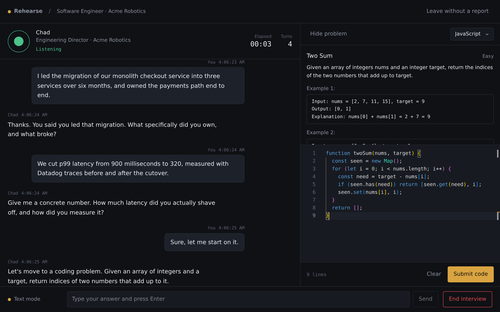
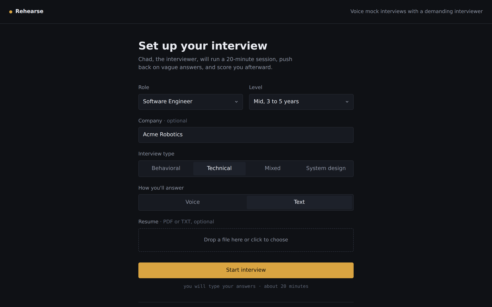
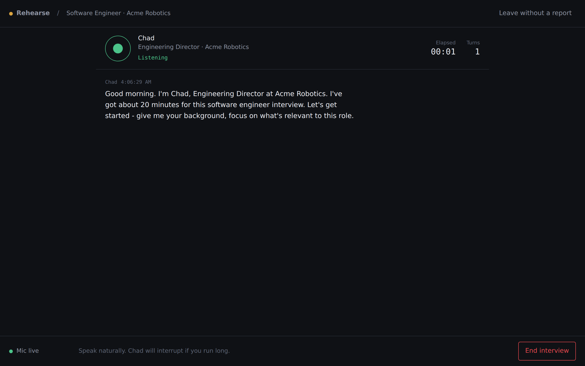
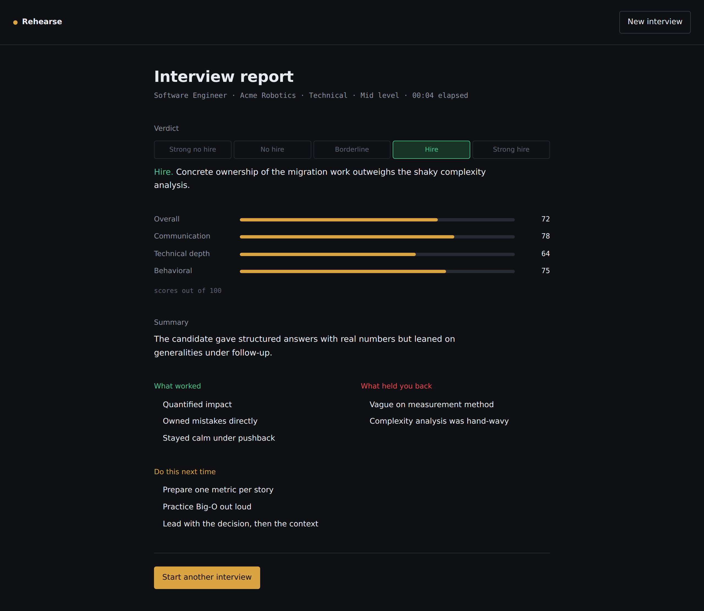
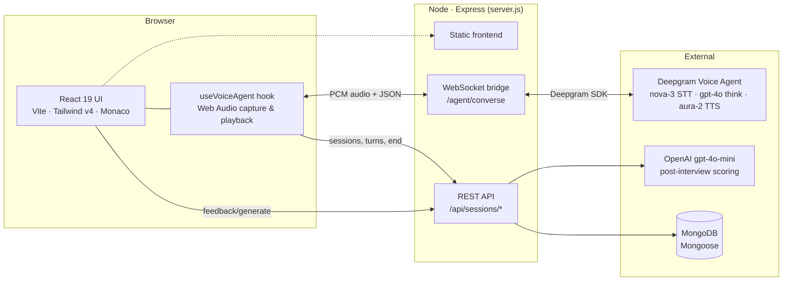
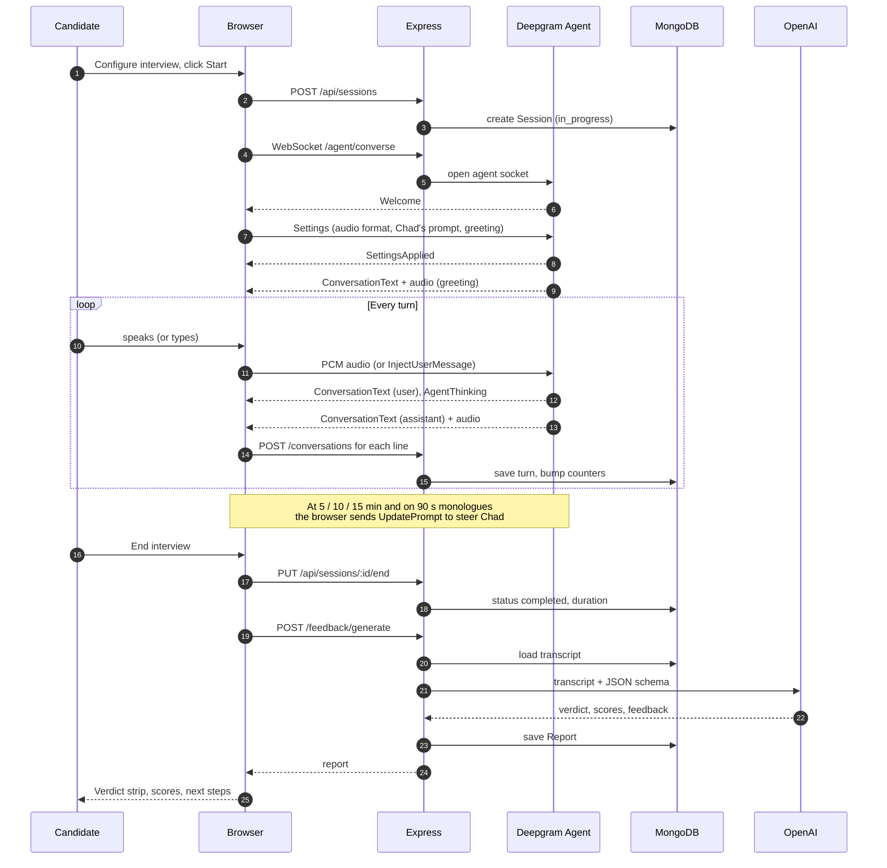
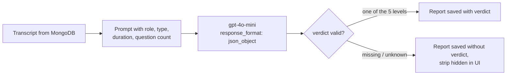
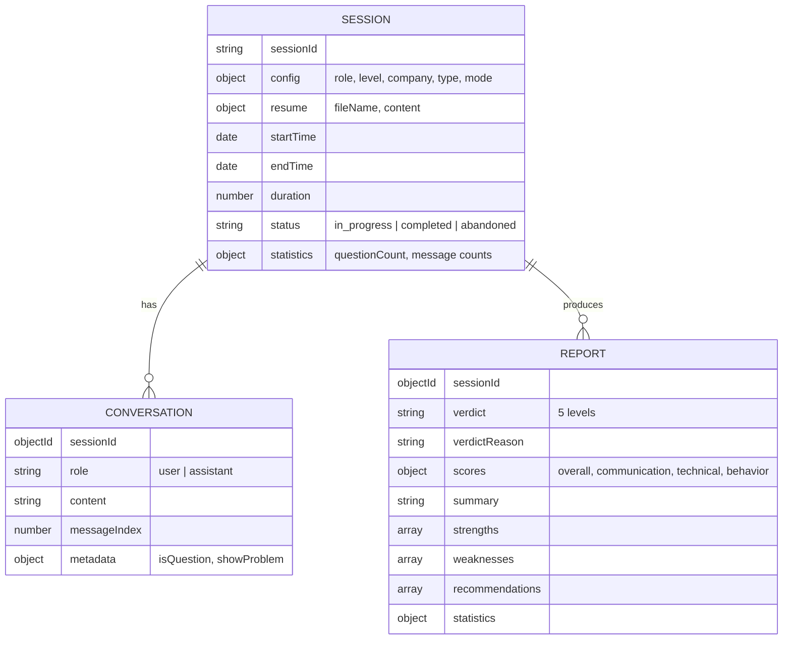

<div align="center">

# Rehearse

**Real-time voice mock interviews with an interviewer who pushes back.**

Rehearse puts you in a timed, spoken interview with "Chad", an AI Engineering Director who challenges vague answers, drops a live coding problem into an editor for technical rounds, and hands you a hiring verdict and scored report the moment you hang up.

[](https://nodejs.org)
[](https://react.dev)
[](https://deepgram.com/product/voice-agent-api)
[](https://platform.openai.com)
[](https://www.mongodb.com)
[](LICENSE)



</div>

---

## Table of contents

- [The problem](#the-problem)
- [The solution](#the-solution)
- [How it works](#how-it-works)
- [Architecture](#architecture)
- [Interview lifecycle](#interview-lifecycle)
- [The interviewer](#the-interviewer)
- [The report](#the-report)
- [Data model](#data-model)
- [Tech stack](#tech-stack)
- [Getting started](#getting-started)
- [Deployment](#deployment)
- [API reference](#api-reference)
- [Project structure](#project-structure)
- [Contributing](#contributing)

---

## The problem

Practising for interviews is lonely and low-fidelity. Reading question lists does not prepare you for a real interviewer who interrupts, asks "why" three times in a row, and wants a number instead of a story. Booking a human mock interview is expensive and hard to schedule. Chat-based practice tools let you type polished paragraphs at your own pace, which is nothing like speaking under pressure.

Candidates need somewhere to **rehearse the actual experience**: speaking out loud, being challenged in real time, coding while someone watches the clock, and then getting an honest read on how it went.

## The solution

Rehearse is a full interview loop in one browser tab:

| | What you get |
|---|---|
| **Live voice interview** | Sub-second, full-duplex conversation over Deepgram's Voice Agent API. You talk, Chad talks back. Text mode is there when you cannot use a microphone. |
| **A demanding persona** | Chad is prompted to be a skeptical Engineering Director: no small talk, follow-ups on every answer, no credit for buzzwords. |
| **Tailored to you** | Pick a role, seniority, company, and interview type. Attach a resume and Chad asks about *your* projects. |
| **Coding rounds** | In technical and mixed interviews Chad introduces a problem mid-conversation. It appears in a Monaco editor beside the transcript, and your submission goes straight back into the interview. |
| **Time pressure** | A 20-minute clock. Chad is nudged at 5, 10, and 15 minutes to pace the interview, and told to cut in if you ramble past 90 seconds. |
| **Honest scoring** | When you end the session the full transcript is sent to gpt-4o-mini, which returns a five-level hiring verdict, four scores out of 100, and concrete strengths, weaknesses, and next steps. Chad never reveals the verdict during the interview. |

---

## How it works

<table>
  <tr>
    <td width="50%" valign="top">
      <b>1. Set up the interview</b><br>
      Choose role, level, company, interview type (behavioral, technical, mixed, system design) and whether you will speak or type. Drop in a PDF or TXT resume; it is parsed in the browser and never leaves your machine except inside the interviewer prompt.<br><br>
      
    </td>
    <td width="50%" valign="top">
      <b>2. Talk to Chad</b><br>
      The microphone streams 16 kHz PCM to the server, which relays it to Deepgram. Chad's replies come back as text for the transcript and as 24 kHz audio for playback. The ring next to his name shows whether he is listening, thinking, or speaking.<br><br>
      
    </td>
  </tr>
  <tr>
    <td width="50%" valign="top">
      <b>3. Code when asked</b><br>
      In technical rounds Chad's message carries a hidden marker that reveals the problem panel and editor. Submit and the code is injected into the conversation as your turn, so Chad can critique it and ask about complexity.<br><br>
      
    </td>
    <td width="50%" valign="top">
      <b>4. Get the verdict</b><br>
      Ending the interview closes the session, then the transcript is scored. The report leads with a hiring verdict strip, followed by score bars, a summary, and three action lists.<br><br>
      
    </td>
  </tr>
</table>

---

## Architecture

One Node process serves everything. Express hosts the built React app and the REST API, and the same HTTP server upgrades `/agent/converse` into a WebSocket that is bridged to Deepgram. Keeping the Deepgram connection server-side means the API key never reaches the browser and the client only ever talks to one origin.



**Why this shape**

- **Bridge, not direct.** Deepgram's agent socket needs an API key in the handshake. Proxying through Express keeps secrets on the server and lets the server validate the `Settings` message before the agent ever sees it.
- **One origin.** In production the frontend, API, and WebSocket share port 3000, so there is no CORS, no separate static host, and one Docker image to deploy.
- **Persist as you go.** Every transcript line is written to MongoDB the moment it arrives, so a dropped connection still leaves a scorable session.
- **Score after, not during.** The interview model (inside Deepgram) is optimised for latency. The report uses a separate OpenAI call with the full transcript and a strict JSON schema, so scoring never slows the conversation.

---

## Interview lifecycle



---

## The interviewer

Chad's behaviour is a single prompt assembled in the browser from the setup form and sent to Deepgram in the `Settings` message. The prompt is built from these parts:

| Input | Effect on the prompt |
|---|---|
| Role and level | "Conducting a rigorous interview for a **Data Scientist, senior position (6–10 years)**" |
| Company | Chad introduces himself as Engineering Director there |
| Interview type | A focus block: behavioral stories with outcomes, technical depth plus the coding problem, mixed, or a system design exercise with scaling and failure-mode follow-ups |
| Resume | The first 3,000 characters are embedded with instructions to probe listed projects and technologies |
| Technical / mixed | The Two Sum problem and a `[SHOW_PROBLEM]` marker Chad must emit when introducing it; the UI strips the marker and opens the editor |
| Text mode | A note that the candidate is typing, so Chad waits for input |

Two rules are hard-coded regardless of setup: **never restart or repeat a question when the prompt is updated mid-session**, and **never tell the candidate whether they passed, how they scored, or whether they would be hired**. The verdict lives only in the written report.

Mid-interview steering uses Deepgram's `UpdatePrompt`, which *appends* to the live prompt. Rehearse sends only a one-line note ("15 minutes have passed, begin wrapping up") rather than re-sending the whole script, which is what stops the agent from treating the update as a fresh interview.

---

## The report

Scoring runs once, after the session is marked complete, against the stored transcript.



The model returns:

- **`verdict`**: `strong_no_hire` · `no_hire` · `borderline` · `hire` · `strong_hire`. The server normalises casing and separators, validates against the enum, and drops anything else instead of failing the report.
- **`verdictReason`**: one sentence.
- **`scores`**: overall, communication, technical, behavior, each 0–100.
- **`summary`**, **`strengths`**, **`weaknesses`**, **`recommendations`**.

The UI renders the verdict as a five-cell strip. The chosen cell is filled green for the hire levels, red for the no-hire levels, and amber for borderline, using the same colour tokens as the rest of the app.

---

## Data model



---

## Tech stack

| Layer | Choice | Why |
|---|---|---|
| UI | React 19, Vite 7, Tailwind CSS v4 | Fast dev loop; design tokens live in one `@theme` block |
| Editor | Monaco | The same editor as VS Code, with syntax highlighting for the coding round |
| Audio | Web Audio API | Raw PCM capture at 16 kHz and scheduled playback at 24 kHz with no plugins |
| Resume parsing | PDF.js (client-side) | The file never uploads; only extracted text reaches the prompt |
| Server | Node 24, Express 5, `ws` | One process for static files, REST, and the WebSocket bridge |
| Voice | Deepgram Voice Agent API | Single socket for STT (nova-3), LLM (gpt-4o), and TTS (aura-2), with barge-in handled by the service |
| Scoring | OpenAI gpt-4o-mini | Cheap, fast, and reliable with `response_format: json_object` |
| Data | MongoDB with Mongoose | Flexible documents for transcripts and reports; Atlas free tier works |
| Packaging | Docker multi-stage, Render Blueprint | One image, one `render.yaml`, health check on `/healthz` |

---

## Getting started

**Prerequisites:** Node 24+, pnpm 10+, a [Deepgram API key](https://console.deepgram.com/signup?jump=keys), an [OpenAI API key](https://platform.openai.com/api-keys), and a MongoDB URI (local or [Atlas](https://www.mongodb.com/cloud/atlas)).

```bash
git clone https://github.com/yechanlin/SB-Hacks.git
cd SB-Hacks
pnpm install && cd frontend && pnpm install && cd ..
cp sample.env .env      # then fill in the three values
```

`.env`:

```bash
DEEPGRAM_API_KEY=...
OPENAI_API_KEY=...
MONGODB_URI=mongodb://localhost:27017/interview-agent
```

Run it:

```bash
pnpm dev      # Express on :3000 + Vite with hot reload
# or
pnpm build && pnpm start
```

Open **http://localhost:3000**. Use port 3000 rather than the Vite port: Express serves the UI and hosts the API and WebSocket. Voice mode needs a microphone permission; on a non-localhost origin it also needs HTTPS.

---

## Deployment

The app is a single long-lived process with a WebSocket, so it needs a host that keeps connections open. Render, Railway, and Fly.io all work; serverless-only platforms will not run the interview.

**Render**

1. Create a new Blueprint pointing at this repo. `render.yaml` defines the web service and builds from the `Dockerfile`.
2. In the service's Environment tab set `DEEPGRAM_API_KEY`, `OPENAI_API_KEY`, and `MONGODB_URI`. For Atlas, allow access from `0.0.0.0/0` or Render's outbound IPs.
3. Render polls `/healthz` and serves the app over HTTPS, which the microphone requires.

**Any Docker host**

```bash
docker build -t rehearse .
docker run -p 3000:3000 \
  -e DEEPGRAM_API_KEY=... -e OPENAI_API_KEY=... -e MONGODB_URI=... \
  rehearse
```

---

## API reference

| Method | Path | Purpose |
|---|---|---|
| `POST` | `/api/sessions` | Create a session from the setup config and resume |
| `GET` | `/api/sessions/:sessionId` | Session with its transcript and latest report |
| `POST` | `/api/sessions/:sessionId/conversations` | Append one transcript line |
| `GET` | `/api/sessions/:sessionId/conversations` | List transcript lines |
| `PUT` | `/api/sessions/:sessionId/end` | Mark completed, record duration and counts |
| `POST` | `/api/sessions/:sessionId/feedback/generate` | Score the transcript with OpenAI and store a report |
| `GET` | `/api/sessions/:sessionId/report` | Latest report for a session |
| `GET` | `/api/problem` | The coding problem shown in the editor |
| `GET` | `/healthz` | Liveness check for hosting platforms |
| `WS` | `/agent/converse` | Voice-agent bridge: JSON control messages and binary PCM both ways |

---

## Project structure

```
.
├── server.js                  Express app, static hosting, WebSocket bridge to Deepgram
├── backend/
│   ├── db.js                  Mongoose connection with troubleshooting output
│   ├── models/                Session, Conversation, Report schemas
│   ├── routes/sessions.js     REST API and the OpenAI scoring prompt
│   └── problems.js            Coding problems served to the editor
├── frontend/
│   ├── index.html
│   └── src/
│       ├── App.jsx            setup → session → report state machine
│       ├── App.css            Design tokens and component styles
│       ├── hooks/useVoiceAgent.js   Audio capture/playback, socket protocol, Chad's prompt
│       ├── pages/             SetupPage, SessionPage, ReportPage
│       ├── components/        SetupForm, Transcript, InterviewerPanel, CodeEditor, SessionBar
│       └── utils/             API client, display labels
├── docs/screenshots/          Images used in this README
├── Dockerfile · render.yaml   Deployment
└── sample.env                 Environment template
```

---

## Contributing

Issues and pull requests are welcome. See [CONTRIBUTING.md](CONTRIBUTING.md) and the [Code of Conduct](CODE_OF_CONDUCT.md).

Rehearse began at SB Hacks and is released under the [MIT License](LICENSE).
